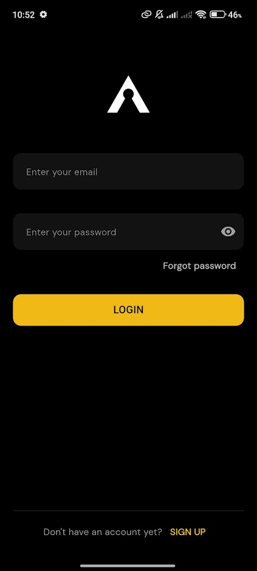

# Aidos - Anonymous Social Media App

A cross-platform social media application designed to enable anonymous expression, open discussion, and community interaction. Built with Flutter and powered by a PocketBase backend, the project focuses on privacy, seamless user experience, and real-time engagement.

## Overview
This application provides a space where users can share thoughts, explore trending topics, and engage with others without revealing their real identity. The app includes essential social features such as posting, commenting, liking, searching, notifications, and profile management — all wrapped in a modern, responsive UI.

<table>
  <tr>
    <td valign="top" style="width:30%;">
      

        
      

      

        
      

      

        
      

    </td>
    <td valign="top" style="width:70%">
      
## Key Features
### **Authentication**
- Secure user registration and login
- Auto-login with persistent sessions
- State management via Provider following MVVM architecture
- Backend communication handled via PocketBase SDK

### **News Feed**
- Dynamic, real-time feed of user posts
- Interactive UI: likes, comments, reposts
- Pull-to-refresh functionality
- Image carousel with swipeable gallery

### **Post Details**
- Full post view with nested comments
- Comment threading with parent-child structure
- Zoomable images using PhotoView
- Optimistic UI for instant user feedback

### **Search**
- Search posts by keyword and topic
- Trending posts when no query is provided
- Search suggestions powered by topics collection
- Unified synchronization with feed data

### **Create Post**
- Compose text-based posts
- Select or create topics
- Upload multiple images
- Image picker support (camera & gallery)

### **Notifications**
- Real-time updates using PocketBase subscriptions
- Local SQLite caching for offline history
- System push notifications
- Swipe-to-delete interactions

### **Profile Management**
- View and edit profile information
- Tabs for posts, replies, and reposts
- Sliding panel UI for editing
- Avatar update and account management

## Architecture
The application follows the **MVVM (Model-View-ViewModel)** structure using Provider for shared state management.

### **Frontend**
- **Framework:** Flutter (cross-platform)
- **State Management:** Provider
- **Routing:** go_router
- **UI Enhancements:** PhotoView, SlidingUpPanel, Google Fonts
- **Responsive Design:** flutter_screenutil

### **Backend**
- **Core Backend:** PocketBase (self-hosted)
- **Database:** Collections for users, posts, comments, topics, notifications
- **Realtime Events:** PocketBase subscriptions

### **Local Persistence**
- **Authentication:** shared_preferences
- **Notifications Cache:** SQLite (sqflite)

## API & Data
PocketBase SDK handles communication with a REST-like backend.

### **Example Data Structures**
- **Users:** id, username, email, avatar, timestamps
- **Posts:** id, content, userId, topicId, images, engagement metrics
- **Comments:** id, postId, parentId, rootId, content, likes, replies
- **Notifications:** id, userId, title, body, type, targetId, isRead

## Tech Stack
- **Flutter** (UI, logic, state)
- **Dart** (application language)
- **PocketBase** (backend & real-time events)
- **SQLite** (local caching)
- **Provider** (state management)
- **go_router** (routing)
- **image_picker**, **photo_view**, **sliding_up_panel**, **google_fonts**

## Deployment
The application is deployable to both Android and iOS. The backend is hosted as a PocketBase instance configured via environment variables.

## Contributors
- **Lê Trọng Trí (B2206019)** – Authentication, Feed, Search, Notifications, Comment System, Repost
- **Huỳnh Tiểu Băng (B2205973)** – Post Creation, Profile, Responsive UI, Deployment
    </td>
  </tr>
</table>
